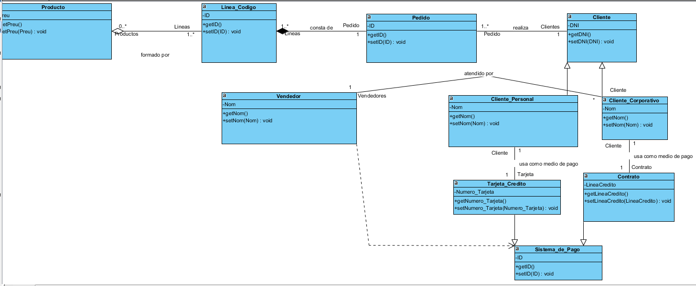
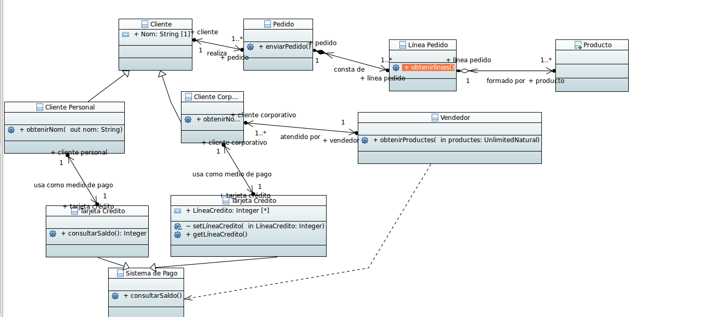

## Pràctica UML 2

1 - Modelitzar el problema.

2 - Fer el diagrama de classes amb Visual Paradigm.

#### Relació: Línea Pedido-Producto
- Una linea de comanda (és una relació dèbil, si desapareixés la linea de comanda, no ho faria el producte) pot estar formada per un producte o més, i un producte pot formar cap o moltes línies de comandes.
#### Relació: Línea Pedido-Pedido
- una comanda (és una relació forta, si desapareix la comanda, també ho fa la línea de comandes) consta de una línea de comandament, i una línea de comandament pot constar en una comanda.
#### Relació: Pedido-Cliente
- un client pot realitzar una o més comandes, una comanda pot ser realitzada per un client.
####  Relació: Client (Cliente Personal i Cliente Corporativo)
- Hi ha dos tipus de clients, el personal (pagarà amb una targeta de crèdit) i el corporatiu (tindrà un contracte amb l'empresa)
####    Relació: Cliente Corporativo-Vendedor
- Un client corporatiu pot ser atès per un venedor, i un venedor pot atendre a molts clients corporatiu
#### Relació: Client Personal-Targeta de crèdit
- Un client personal pot utilitzar una targeta de crèdit per pagar, i una targeta pot ser usada pel client.
#### Relació Cliente Corporativo-Contrato
   - Un client corporatiu pot utilitzar un contracte per pagar, i un contracte pot ser usat pel client.
#### Relació Sistema de Pago
 - Hi ha dos tipus de mètodes de pagament, per targeta de crèdit o per contracte
#### Relació Vendedor-Sistema de Pagament
- El venedor depent d'un dels dos sistemes de pagament per poder cobrar.

3 - Fer el mateix amb Papyrus.

